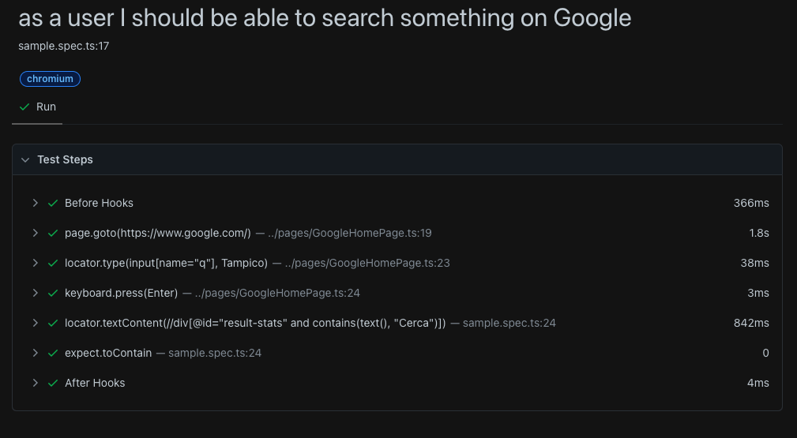

# Automation Framework made with TS + Playwright

The goal of this project was to put into practice my knowledge using this amazing tool for automation testing.

**Before you continue reading:** *You can check in this repository a sample made with [TS](https://github.com/ArCiGo/TS-Playwright-Automation-Framework/tree/AutomationFrameworkSample_TS).*

## The project 💻

A *Playwright* template to create new automation framework projects!

## Tools ⚙️

* *Playwright v1.28.1*.
* *GitHub Actions*.

## Main project structure 🗂️

```bash
.
├── .github/
│   └── workflows/
│       └── playwright.yml
├── pages/
│   ├── GoogleHomePage.ts
│   ├── GoogleResultsPage.ts
├── tests/
│   ├── sample.spec.ts
├── .env.template
├── package.json
└── playwright.config.ts
```

## Setup 🛠️

The following steps can be executed using a terminal (I use [hyper](https://hyper.is/)), or using the terminal provided by VS Code.

1. Clone the repo on your computer at any path you want.-

```bash
> git clone https://github.com/ArCiGo/TS-Playwright-Automation-Framework.git

> git checkout master
```

2. In the path you cloned the repo, open the project folder and install the packages.-

```bash
> cd TS-Playwright-Automation-Framework

> npm i
```

3. Before to execute the tests, you need to create a *.env* file at root level. There is a *.env.template* file with the structure that should follow your *.env* file. Just delete the *.template* suffix and fill with the values you want to use.

## Run the tests ⚡

```bash
# If you want to just only run the tests, execute the following command:
> npm run execute:tests
# If you want to see a report of your executed tests, execute the following command:
> npm run execute:report

# If you want to execute the both commands above:
> npm run playwright:all
```

When you execute the command to see the report, a new folder is generated at root level (**playwright-report**). This folder contains the report for the executed tests.



## Collaborations 👨‍🏭

Do you want to collaborate or contribute in this project? No problem! I'm open to improvements, comments and suggestions. Just do a PR with your suggestions and we can discuss them 😀